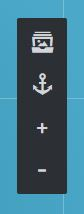
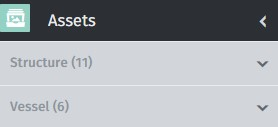
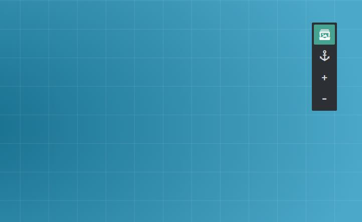

# Welcome to Field Activity Planner

For full product documentation visit [www.xvision.no](http://www.xvision.no).

# Projects

This is the first screen that you will see after logging in. The Projects screen will list all project(s) belonging to your company account. The top part of the application screen will display Project Cards for the four (4) most recent projects that have been worked on as shown here:

The cards will list the project name, its active state and when it was last updated. 

In addition it will provide command shortcuts for Open, Copy, Delete and allow you to access the individual Project settings. You will also see the name of the project creator listed. 

Below the project cards section you will see a list of all other projects or project folders for your account as shown: 

For more information on these commands see the Project Actions section.

##Open Project

To open a project simply click on the Open Project button shown below.

This will then load the selected project and display it on screen for further editing/viewing.

##Add Project

Select the Add project button from the top right area of the Projects screen to create a new project. 

This will display the new project screen where you specify a project name and optional Start and End date for the project. The Start- and End-date fields will present you with a Month-calendar picker for quick and easy date selection. Then click Save project to create it or cancel to exit without making any changed.

##Add Folder

Select the Add folder button from the top right area of the Projects screen to create a new project folder. 

This will display a dialog promting you for the name of the new folder that you wish to create. Simply enter the new folder name in the text field. Then click "Save" to create it or cancel to exit without making any changed.

#Asset selector

To populate your field layout you need to choose your structures from the Asset library.

Open the asset library by clicking the "Asset picker" icon shown above, which is located in the top left part of the Stage Area as shown below:

This will reveal the asset library selector catalog as shown below. You can view the assets by category namely; Structures and Vessels. The number of assets in each category is shown behind the category name.

Select if you want an asset from either the Structure or Vessel category by clicking on the desired category. This will automatically expand the image list to display all assets in that category.

To add an asset to your field layout design in the Stage Area, simply click it and hold down the left mouse button while you drag it out of the asset list selector and onto the stage area on the right and release the mouse button.

###Rotate / Delete Asset
You can easily reposition and rotate your assets by clicking on them to. You will notice a dotted ring around the asset with 2 symbols (Rotate button and delete button).
To reposition the asset just click again on the active asset and hold the left mousebutton down while you reposition it and let let go. To Rotate it just activate the dottet ring by clicking on the asset and press the rotate button and hold the left mousebutton down while you rotate the asset to your wanted angle.

###Connect Assets
FieldAP comes with a set of the most normal generic assets that can be used for a simple field layout. Most of these assets can be connected to each other as would be expected for a field layout. At present all assets have a fixed number and fixed location of connection points. 
The number of asset connection points depends on the asset you have selected. They are typically located just off the asset outline itself as show in the illustration below:

To make a connection between two (2) assets or structures if you will you need to click once on the starting connection point once the mouse cursor changes to a cross selector. Then move the mouse over to the asset connection point that you want to connect to and click once again when the cross selector cursor is shown. The assets will then be connected together.

Note that you can have as many connections between structures that you want.

###Edit Connections
If you click on the connection line itself between two assets, you can add curvature edit points, which allows you to modify the layout of the connection line or connector if you will. You will see a small "+" symbol next to the mouse pointer that indicates that by a left mouse click a curve edit point will be added.

To remove an edit point from the connector press and hold the "Shift" key and select the edit point on the connector. To remove an entire connection, press the "Backspace" key.

###Connection Color
You can also choose the color and thickness on your connections by choosing them in the menu below the stage grid.
(image when the design is ready)

###Stage Area

The stage area is your drawing canvas where you do your field layout design work as shown in the illustration below:

You can zoom in and out on the stage area by pressing the zoom buttons in the top right of the stage area window.
Additionally you can also utilize the mouse wheel to zoom in and out.

You can pan the stage area by clicking on the stage area background and holding down the left mouse button and move the mouse in the desired direction